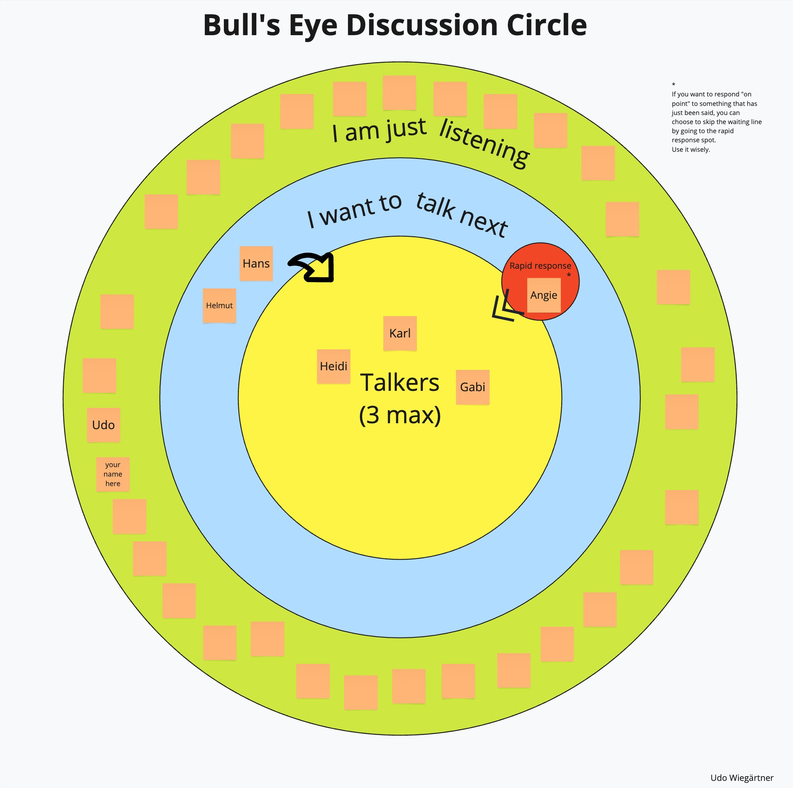

# About
This project contains some Miro templates.
Feel free to use and modify them. Please mention me as author (CC BY-SA 4.0).
Feedback and ideas welcome.

# Usage
The .rtb files are backups of Miro boards. You can import them to Miro:
- Go to your Miro dashboard
- Click "Create new"
- Import > Import Backup

# Bulls Eye Discussion
This board is for virtual Fish Bowl discussions

<a href="BullsEyeDiscussion_Miro.rtb">Download (right click + save as)</a>

